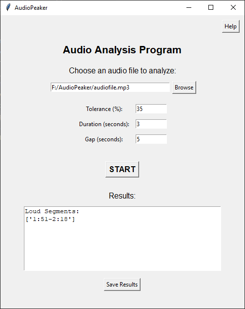

# AudioPeaker
AudioPeaker is a Python-based tool that analyzes audio files to detect and timestamp loud segments. It provides a graphical user interface (GUI) for ease of use and outputs the results in JSON format.
The name is a play on words for what it does: it takes in an audio file, takes a peek at the peak volumes and picks them out for you.


---

## Features

- **Detect Loud Segments**: Identifies areas in the audio where loudness exceeds a user-defined threshold.
- **Timestamp Conversion**: Converts detected segments into human-readable MM:SS format.
- **Merge Consecutive Segments**: Merges timestamps that are close together based on a user-defined gap.
- **Customizable Parameters**:
  - **Tolerance**: Set the loudness threshold as a percentage.
  - **Duration**: Specify the minimum length of a loud segment.
  - **Gap**: Define the maximum silence allowed between segments.
- **Save Results**: Outputs the analysis results as a JSON file.
- **User-Friendly GUI**: Built with `tkinter`, the GUI allows users to easily select files, configure parameters, and view results.

---

## How It Works

1. **Load Audio File**:
   - The user selects an audio file (`.mp3`, `.wav`, `.flac`, `.ogg`) through the GUI.

2. **Analyze Audio**:
   - The program detects loud segments based on the provided tolerance (loudness threshold).
   - Converts detected segments into timestamps in MM:SS format.
   - Merges consecutive timestamps based on the gap parameter and filters out segments shorter than the specified duration.

3. **Display Results**:
   - The results are displayed in the GUI and can be saved as a JSON file.

4. **Save Results**:
   - The results are saved in a JSON file for further use.

---

## Installation

### Prerequisites
- Python 3.7 or higher
- Required Python libraries:
  - `tkinter` (comes pre-installed with Python)
  - `librosa`

### Steps
1. Clone the repository:
   ```bash
   git clone https://github.com/kirchroland95/audiopeaker.git
   cd audiopeaker
   ```

2. Install the required dependencies:
   ```bash
   pip install librosa
   ```

3. Run the application:
   ```bash
   python main.py
   ```

### Output Format
The results are saved in a JSON file with the following structure:

```json
{
    "loud_segments": ["0:07-0:25", "0:38-2:31", "9:44-9:53"]
}
```

---

### Planned Future Features
- Add support for additional audio formats if needed.
- Allow users to export results in other formats.
- Add automatic tolerance calculator option for audio files that have constant speaking
- Add additional quality-of-life improvements if requested